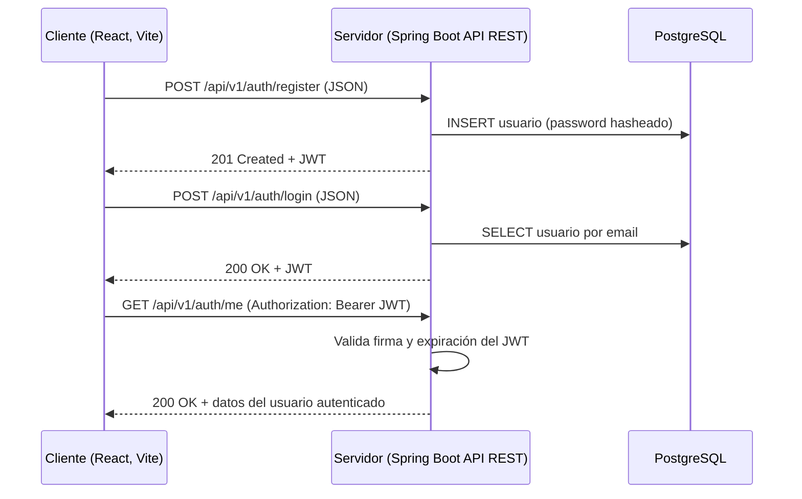

# veterinaria-api

Backend del sistema para clínicas veterinarias: historias clínicas, consultas, citas, seguimiento
de mascotas y resúmenes de consulta generados con IA (revisados y aprobados por el veterinario
antes de enviarse al dueño).

## Modelo cliente-servidor (primera entrega)



- **Cliente**: SPA en React (equipo de frontend), corre en `http://localhost:5173`, consume la API por
  HTTP/JSON.
- **Servidor**: esta API REST en Spring Boot, sin estado (autenticación vía JWT, sin sesiones), con
  PostgreSQL como única fuente de verdad.
- **Contrato**: definido y documentado con OpenAPI/Swagger (`/swagger-ui.html`), para que el equipo
  de frontend lo consulte sin depender de este repo.

## Cómo correr en local

Todo el backend (API + PostgreSQL) corre en Docker con un solo comando:

```bash
docker-compose up -d --build   # construye la imagen de la API y levanta API + PostgreSQL
```

- API: http://localhost:8080
- Swagger UI: http://localhost:8080/swagger-ui.html
- Health check: http://localhost:8080/actuator/health
- PostgreSQL: localhost:5432 (para conectarte con un cliente de DB si lo necesitas)

También se puede correr solo PostgreSQL en Docker y la API desde el IDE/`mvnw` (más cómodo para
desarrollar con recarga en caliente):

```bash
docker-compose up -d postgres  # solo la base de datos
./mvnw spring-boot:run          # la API en localhost:8080, con devtools
```

Variables de entorno soportadas (todas con default de desarrollo): `DB_URL`, `DB_USER`, `DB_PASSWORD`,
`CORS_ALLOWED_ORIGINS`, `JWT_EXPIRATION_MINUTES`.

## Arquitectura: monolito modular listo para microservicios

Esta primera entrega es un **monolito modular**: un único despliegue, pero organizado en paquetes que
respetan los límites de dominio que eventualmente se convertirán en microservicios independientes.
Cada módulo solo se comunica con los demás a través de su capa de servicio (nunca accede directo al
repositorio de otro módulo), para que extraerlo después sea mover el paquete + su tabla a un servicio
nuevo, no reescribir la lógica.

| Paquete actual | Responsabilidad hoy | Futuro microservicio |
|---|---|---|
| `auth` | Registro, login, emisión de JWT | `auth-service` |
| `usuarios` | Entidad y datos de usuarios (administradores, veterinarios; dueños más adelante) | `usuarios-service` |
| `security` | Configuración de Spring Security y llaves JWT | Se reparte entre `auth-service` y un API Gateway |
| `common` | Manejo de errores compartido | Librería/convención común entre servicios |
| *(pendiente)* citas | — | `citas-service` |
| *(pendiente)* historias clínicas / consultas | — | `historias-clinicas-service` |
| *(pendiente)* resumen con IA | — | `ia-resumen-service` (async, disparado por eventos de consulta) |

Cuando se dé el salto a microservicios, el plan natural es: un **API Gateway** al frente (enruta y
valida el JWT una sola vez), **una base de datos por servicio**, y **mensajería asíncrona** (ej.
RabbitMQ/Kafka) para casos como "se cerró una consulta → generar resumen con IA → notificar al
dueño", sin acoplar servicios entre sí de forma síncrona.

## Roles (primera entrega)

- `ADMINISTRADOR`
- `VETERINARIO`

El rol `DUEÑO` (cliente final, dueño de mascota) se agrega en una entrega posterior.

## Endpoints de autenticación

| Método | Ruta | Auth | Descripción |
|---|---|---|---|
| POST | `/api/v1/auth/register` | pública | Crea un usuario (`nombre`, `email`, `password`, `rol`) y devuelve un JWT |
| POST | `/api/v1/auth/login` | pública | Autentica por `email`/`password` y devuelve un JWT |
| GET | `/api/v1/auth/me` | JWT | Devuelve el usuario autenticado (prueba end-to-end del flujo cliente-servidor) |

> Nota de seguridad: en esta primera entrega `register` es público y permite elegir el rol, para que
> el frontend pueda probar el flujo completo sin datos previos. Antes de producción, restringir la
> creación de `ADMINISTRADOR`/`VETERINARIO` a un usuario admin ya autenticado.
