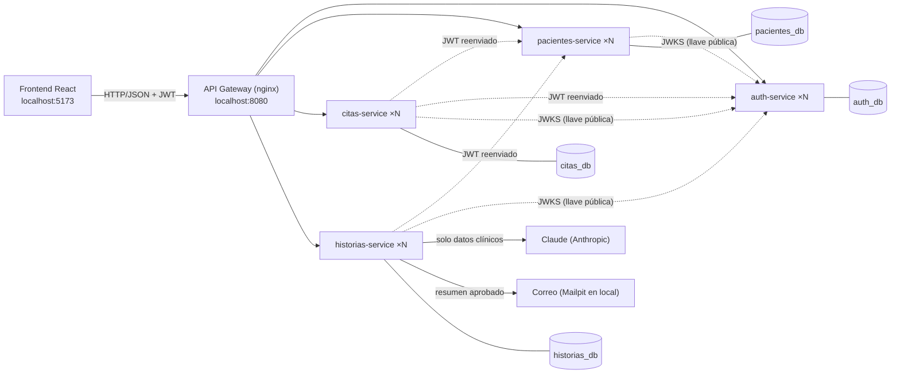

# veterinaria-api

Backend del sistema para clínicas veterinarias: historias clínicas, consultas, citas, seguimiento
de mascotas y resúmenes de consulta generados con IA (revisados y aprobados por el veterinario
antes de enviarse al dueño).

## Arquitectura: microservicios con escalado horizontal


```mermaid
flowchart LR
    FE["Frontend React<br/>localhost:5173"] -->|HTTP/JSON + JWT| GW["API Gateway (nginx)<br/>localhost:8080"]
    GW --> AUTH["auth-service ×N"]
    GW --> PAC["pacientes-service ×N"]
    GW --> CIT["citas-service ×N"]
    GW --> HIS["historias-service ×N"]
    CIT -. "JWT reenviado" .-> PAC
    CIT -. "JWT reenviado" .-> AUTH
    HIS -. "JWT reenviado" .-> PAC
    PAC & CIT & HIS -. "JWKS (llave pública)" .-> AUTH
    HIS -->|"solo datos clínicos"| IA["Claude (Anthropic)"]
    HIS -->|"resumen aprobado"| MAIL["Correo (Mailpit en local)"]
    AUTH --- DB1[("auth_db")]
    PAC --- DB2[("pacientes_db")]
    CIT --- DB3[("citas_db")]
    HIS --- DB4[("historias_db")]
```

| Módulo | Responsabilidad | Base de datos |
|---|---|---|
| `common` | Librería compartida: `ApiError` y manejo de errores, seguridad de Resource Server, `UsuarioActual`, cliente HTTP con token relay, OpenAPI. Test-jar con JWT de prueba y PostgreSQL (Testcontainers) | — |
| `auth-service` | Registro, login, emisión de JWT (RS256) y su JWKS, perfil del usuario, directorio de veterinarios | `auth_db` |
| `pacientes-service` | Propietarios (con autorización de tratamiento de datos, Ley 1581) y mascotas | `pacientes_db` |
| `citas-service` | Agenda: agendar, reprogramar, cancelar, estados. Sin solapamientos (`EXCLUDE USING gist`) | `citas_db` |
| `historias-service` | Historia clínica inmutable (consultas, enmiendas), vacunas, seguimiento y resúmenes IA | `historias_db` |

**Por qué escala horizontalmente**

- **Servicios sin estado**: la sesión es un JWT; cualquier réplica atiende cualquier petición.
- **Llaves JWT compartidas**: todas las réplicas de `auth-service` firman con el mismo par RSA (PEM montado
  desde un volumen); el `kid` se deriva de la llave. Los demás servicios validan con el JWKS de `auth-service`
  (`/.well-known/jwks.json`), sin compartir secretos.
- **Gateway con balanceo**: nginx resuelve el DNS de Docker en cada petición y reparte entre las réplicas, así
  que `docker compose up --scale citas-service=4` funciona sin reiniciar el gateway.
- **Reglas en la base de datos, no en memoria**: el no solapamiento de citas, la inmutabilidad de la historia
  clínica y la aprobación obligatoria de resúmenes los garantiza PostgreSQL, así que se cumplen aunque varias
  réplicas escriban a la vez. Flyway usa un lock de PostgreSQL: varias réplicas pueden arrancar a la vez.
- **Rol de aplicación sin privilegios de dueño**: Flyway migra con el dueño de las tablas y los servicios corren
  con `veterinaria_app` (sin `DELETE`/`TRUNCATE`, sin poder desactivar triggers). En Render: crear ese rol y
  configurar `SPRING_FLYWAY_USER`/`SPRING_FLYWAY_PASSWORD` con el dueño y `DB_USER`/`DB_PASSWORD` con la app.
- **Una base de datos por servicio**: ningún servicio lee tablas de otro; se comunican por HTTP reenviando el
  JWT del usuario (token relay), de modo que el servicio dueño del dato aplica sus reglas de pertenencia.

## Cómo correr en local

Requiere Docker. Todo el backend con 2 réplicas por microservicio:

```bash
docker compose up -d --build
```

- Gateway (lo que usa el frontend, `VITE_API_URL=http://localhost:8080`): http://localhost:8080
- Swagger UI con los 4 contratos: http://localhost:8080/docs/
- Correos enviados (Mailpit): http://localhost:8025
- PostgreSQL: `localhost:5432` (usuario/clave `veterinaria`; bases `auth_db`, `pacientes_db`, `citas_db`, `historias_db`)

Escalar: `REPLICAS=3 docker compose up -d` (todos) o `docker compose up -d --scale historias-service=4` (uno).

Para resúmenes con IA real exporta `ANTHROPIC_API_KEY` antes de `docker compose up`. Sin clave, el borrador se
arma con una plantilla local y el flujo de revisión y aprobación es idéntico.

Desarrollo de un servicio desde el IDE: `docker compose up -d postgres mailpit` y luego
`./mvnw -pl auth-service spring-boot:run` (puertos locales: auth 8081, pacientes 8082, citas 8083, historias 8084).

Pruebas: `./mvnw verify` (necesita Docker por Testcontainers).

## Roles

- `ADMINISTRADOR` y `VETERINARIO`: personal de la clínica.
- `PROPIETARIO`: dueño de mascota. Para ver sus mascotas, citas e historia clínica, su cuenta se vincula con
  el registro que creó la clínica mediante un **código de un solo uso**: el personal lo genera con
  `POST /api/v1/propietarios/{id}/codigo-vinculacion` (vence en 7 días) y se lo entrega al dueño, que lo
  canjea con `POST /api/v1/propietarios/me/vincular`. No se vincula por email porque el email de una cuenta
  nueva no está verificado: cualquiera podría registrarse con el de otra persona.

> Nota de seguridad: `register` sigue siendo público y permite elegir el rol, para que el frontend pueda probar
> el flujo completo. Antes de producción: restringir la creación de `ADMINISTRADOR`/`VETERINARIO` a un admin
> autenticado, verificar el email, limitar intentos de login y desactivar Swagger.

## Endpoints (todos bajo el gateway `http://localhost:8080`)

Todo requiere `Authorization: Bearer <JWT>` salvo lo marcado como público. Errores con el formato `ApiError`
(`timestamp`, `status`, `error`, `message`, `path`, `detalles`). 401 = sin token o token inválido,
403 = sin permiso o recurso ajeno, 404 = no existe, 409 = conflicto, 422 = regla de negocio.

**Personal** = `ADMINISTRADOR` o `VETERINARIO`. **Dueño** = `PROPIETARIO`, solo sobre sus propios recursos.

### auth-service

| Método | Ruta | Quién | Descripción |
|---|---|---|---|
| POST | `/api/v1/auth/register` | pública | Crea usuario (`nombre`, `email`, `password`, `rol`) y devuelve JWT |
| POST | `/api/v1/auth/login` | pública | Login por `email`/`password`, devuelve JWT |
| GET | `/api/v1/auth/me` | cualquiera | Usuario autenticado |
| GET | `/api/v1/usuarios/me` | cualquiera | Perfil del usuario |
| PUT | `/api/v1/usuarios/me` | cualquiera | Cambia el nombre |
| PUT | `/api/v1/usuarios/me/password` | cualquiera | Cambia la contraseña (`passwordActual`, `passwordNueva`) |
| GET | `/api/v1/usuarios/veterinarios` | cualquiera | Veterinarios activos (para agendar) |

### pacientes-service

| Método | Ruta | Quién | Descripción |
|---|---|---|---|
| POST | `/api/v1/propietarios` | personal | Registra propietario; exige `aceptaTratamientoDatos: true` |
| GET | `/api/v1/propietarios?busqueda=&pagina=&tamano=` | personal | Lista paginada, busca por nombre o documento |
| GET | `/api/v1/propietarios/{id}` | personal, dueño | Detalle |
| PUT | `/api/v1/propietarios/{id}` | personal | Edita |
| POST | `/api/v1/propietarios/{id}/codigo-vinculacion` | personal | Código de un solo uso para vincular la cuenta del dueño |
| POST | `/api/v1/propietarios/me/vincular` | dueño | Vincula su cuenta con el código (`codigo`) |
| GET | `/api/v1/propietarios/me` | dueño | Sus datos (perfil del cliente); 404 si aún no está vinculado |
| PUT | `/api/v1/propietarios/me` | dueño | Edita su teléfono y dirección |
| POST | `/api/v1/mascotas` | personal | Registra mascota |
| GET | `/api/v1/mascotas?propietarioId=&pagina=&tamano=` | personal | Lista paginada |
| GET | `/api/v1/mascotas/mias` | dueño | **Mis mascotas** |
| GET | `/api/v1/mascotas/{id}` | personal, dueño | Detalle |
| PUT | `/api/v1/mascotas/{id}` | personal | Edita (incluye `activo`) |

### citas-service

| Método | Ruta | Quién | Descripción |
|---|---|---|---|
| POST | `/api/v1/citas` | personal, dueño | Agenda (`mascotaId`, `veterinarioId`, `inicio`, `fin`, `motivo`). 409 si se cruza |
| GET | `/api/v1/citas?veterinarioId=&mascotaId=&desde=&hasta=` | personal | Agenda filtrada (fechas ISO-8601) |
| GET | `/api/v1/citas/mias` | dueño, veterinario | **Mis citas** / agenda del veterinario desde hoy |
| GET | `/api/v1/citas/{id}` | personal, dueño | Detalle |
| PATCH | `/api/v1/citas/{id}/cancelar` | personal, dueño | Cancela |
| PATCH | `/api/v1/citas/{id}/reprogramar` | personal, dueño | Nuevo `inicio`/`fin` |
| PATCH | `/api/v1/citas/{id}/estado` | personal | `CONFIRMADA`, `ATENDIDA`, `NO_ASISTIO`, `CANCELADA` |

### historias-service

| Método | Ruta | Quién | Descripción |
|---|---|---|---|
| POST | `/api/v1/consultas` | veterinario | Abre consulta (`mascotaId`, `citaId?`, `datos`) |
| GET | `/api/v1/consultas?mascotaId=` | personal, dueño | Historia clínica (el dueño ve solo consultas cerradas) |
| GET | `/api/v1/consultas/{id}` | personal, dueño | Detalle con enmiendas |
| PUT | `/api/v1/consultas/{id}` | veterinario que atiende | Edita una consulta abierta |
| POST | `/api/v1/consultas/{id}/cerrar` | veterinario que atiende | Cierra (queda inmutable) y genera el borrador del resumen |
| POST | `/api/v1/consultas/{id}/enmiendas` | veterinario | Enmienda una consulta cerrada |
| POST | `/api/v1/vacunas` | veterinario | Registra vacuna aplicada y próxima dosis |
| GET | `/api/v1/vacunas?mascotaId=` | personal, dueño | Carné de vacunación |
| GET | `/api/v1/seguimiento/pendientes?dias=30` | personal | Controles y refuerzos próximos sin atender |
| GET | `/api/v1/resumenes?estado=BORRADOR` | personal | Bandeja de revisión de resúmenes |
| POST | `/api/v1/consultas/{id}/resumen` | veterinario que atiende | Genera el borrador si no se generó al cerrar |
| GET | `/api/v1/consultas/{id}/resumen` | personal, dueño | Resumen de la consulta (el dueño, solo si ya se envió) |
| GET | `/api/v1/resumenes/{id}` | personal, dueño | Igual, por id |
| PUT | `/api/v1/resumenes/{id}` | veterinario que atiende | Edita el borrador (`hallazgos`, `tratamiento`, `cuidadosEnCasa`, `proximaVisita`) |
| POST | `/api/v1/resumenes/{id}/aprobar` | veterinario que atiende | Aprueba (opcional `contenidoFinal`) |
| POST | `/api/v1/resumenes/{id}/enviar` | veterinario que atiende | Envía al dueño por correo; exige `APROBADO` |

## Reglas críticas y dónde se hacen cumplir

| Regla | Aplicación | Base de datos |
|---|---|---|
| Ningún resumen IA llega al dueño sin aprobación del veterinario | `ResumenService.enviar` exige `APROBADO` | CHECK + trigger: solo `BORRADOR → APROBADO → ENVIADO`, nace en `BORRADOR`, contenido aprobado congelado |
| Datos personales del propietario nunca van al modelo | `DatosParaResumen` no tiene campos del propietario; correos y teléfonos escritos en texto libre se enmascaran | — |
| Trazabilidad de la IA | Se guarda modelo, versión de prompt, texto generado y texto final | El texto generado no se puede modificar (trigger) |
| Historia clínica inmutable | Consultas cerradas no se editan; se enmiendan (autor y fecha) | Triggers: no `UPDATE`/`DELETE`/`TRUNCATE` de consultas cerradas; enmiendas y vacunas solo inserción |
| Sin citas cruzadas | Responde 409 | `EXCLUDE USING gist` por veterinario y por mascota |
| Autorización por pertenencia | Cada servicio valida al dueño; entre servicios se reenvía su JWT | — |
