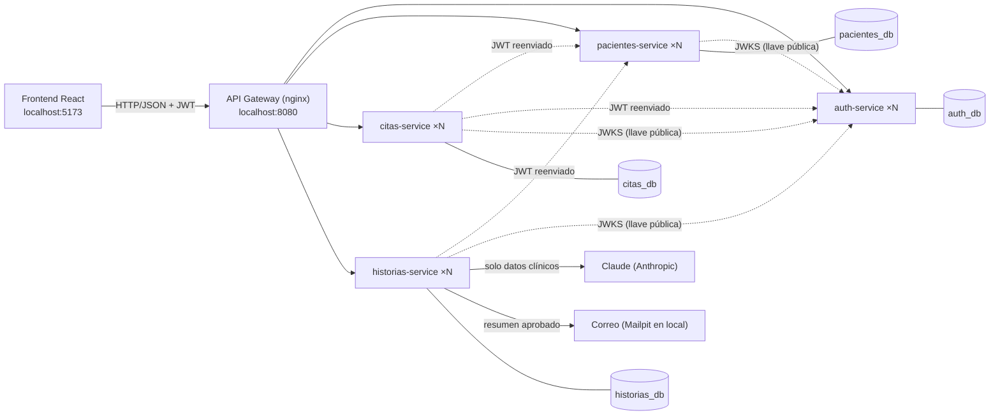

# veterinaria-api

Backend del sistema para clínicas veterinarias: historias clínicas, consultas, citas, seguimiento
de mascotas y resúmenes de consulta generados con IA (revisados y aprobados por el veterinario
antes de enviarse al dueño por correo).

**Quién usa el sistema:** solo el personal de la clínica (`ADMINISTRADOR` y `VETERINARIO`). Los dueños de
mascotas no tienen cuenta: la clínica registra sus datos, con correo obligatorio, y les escribe a ese correo
cuando hay novedades (hoy, el resumen de consulta aprobado).

## Arquitectura: microservicios con escalado horizontal


```mermaid
flowchart LR
    FE["Frontend React<br/>localhost:5173"] -->|HTTP/JSON + JWT| GW["API Gateway (nginx)<br/>localhost:8080"]
    GW --> AUTH["auth-service ×N"]
    GW --> PAC["pacientes-service ×N"]
    GW --> CIT["citas-service ×N"]
    GW --> HIS["historias-service ×N"]
    CIT -. "JWT reenviado" .-> PAC
    CIT -. "JWT reenviado" .-> AUTH
    HIS -. "JWT reenviado" .-> PAC
    PAC & CIT & HIS -. "JWKS (llave pública)" .-> AUTH
    HIS -->|"solo datos clínicos"| IA["Claude (Anthropic)"]
    HIS -->|"resumen aprobado"| MAIL["Correo (Mailpit en local)"]
    AUTH --- DB1[("auth_db")]
    PAC --- DB2[("pacientes_db")]
    CIT --- DB3[("citas_db")]
    HIS --- DB4[("historias_db")]
```

| Módulo | Responsabilidad | Base de datos | Rutas en el gateway |
|---|---|---|---|
| `common` | Librería compartida: `ApiError` y manejo de errores, `Patrones` de validación, seguridad JWT, `UsuarioActual`, cliente HTTP entre servicios, OpenAPI. Test-jar con JWT de prueba y PostgreSQL (Testcontainers) | — | — |
| `auth-service` | Registro, login, emisión de JWT (RS256) y su JWKS, perfil del usuario, directorio de veterinarios, gestión de cuentas del personal | `auth_db` | `/api/v1/auth/**`, `/api/v1/usuarios/**` |
| `pacientes-service` | Propietarios (con autorización de tratamiento de datos, Ley 1581) y mascotas | `pacientes_db` | `/api/v1/propietarios/**`, `/api/v1/mascotas/**` |
| `citas-service` | Agenda: agendar, reprogramar, cancelar, estados. Sin solapamientos (`EXCLUDE USING gist`) | `citas_db` | `/api/v1/citas/**` |
| `historias-service` | Historia clínica inmutable (consultas, enmiendas), vacunas, seguimiento y resúmenes IA | `historias_db` | `/api/v1/consultas/**`, `/vacunas`, `/seguimiento`, `/resumenes` |

Cada microservicio es una aplicación Spring Boot independiente, con su propia base de datos. Ninguno lee tablas
de otro: cuando necesita un dato ajeno lo pide por HTTP reenviando el JWT del usuario (token relay), y el
servicio dueño del dato aplica sus propias reglas.

## Cómo correr en local

Requiere Docker. Todo el backend con 2 réplicas por microservicio:

```bash
docker compose up -d --build
```

- Gateway (lo que usa el frontend, `VITE_API_URL=http://localhost:8080`): http://localhost:8080
- Swagger UI con los 4 contratos: http://localhost:8080/docs/
- Correos enviados (Mailpit): http://localhost:8025
- PostgreSQL: `localhost:5432` (usuario/clave `veterinaria`; bases `auth_db`, `pacientes_db`, `citas_db`, `historias_db`)

Para resúmenes con IA real exporta `ANTHROPIC_API_KEY` antes de `docker compose up`. Sin clave, el borrador se
arma con una plantilla local y el flujo de revisión y aprobación es idéntico.

Desarrollo de un servicio desde el IDE: `docker compose up -d postgres mailpit` y luego
`./mvnw -pl auth-service spring-boot:run` (puertos locales: auth 8081, pacientes 8082, citas 8083, historias 8084).

Pruebas: `./mvnw verify` (necesita Docker por Testcontainers).

Apagar: `docker compose down` (con `-v` también borra los datos).

## Guía para navegar el código

```text
veterinarIA-API/
├── pom.xml                   POM padre: declara los 5 módulos y las versiones comunes
├── common/                   librería compartida (no se despliega sola)
│   ├── .../common/           ApiError, GlobalExceptionHandler, excepciones de negocio, Patrones, RolUsuario
│   ├── .../security/         SecurityConfig (JWT, CORS, rutas públicas), UsuarioActual
│   ├── .../remoto/           ClienteHttpFactory: llamadas entre servicios reenviando el JWT
│   └── .../config/           OpenApiConfig (Swagger)
├── <servicio>-service/
│   └── src/main/
│       ├── java/tech/veterinaria_api/
│       │   ├── <Servicio>ServiceApplication.java
│       │   ├── <tema>/       XController → XService → XRepository → entidad, y dto/ con los records
│       │   └── remoto/       clientes HTTP hacia otros servicios (citas e historias)
│       └── resources/
│           ├── application.properties   conexión a la BD, puerto, JWT, CORS
│           └── db/migration/            esquema de su BD (Flyway)
├── docker/
│   ├── gateway/nginx.conf    qué ruta va a qué servicio
│   └── postgres/init/        crea las 4 bases y el rol de la aplicación (solo la primera vez)
├── docker-compose.yml        despliegue: servicios, réplicas, variables de entorno
├── Dockerfile                una sola receta que construye cualquier servicio (--build-arg SERVICIO=...)
└── docs/api/                 contrato OpenAPI exportado para el frontend
```

Cada paquete de negocio sigue el mismo patrón:

| Pieza | Responsabilidad |
|---|---|
| `XController` | Recibe HTTP, valida el DTO (`@Valid`) y el rol (`@PreAuthorize`) |
| `XService` | Reglas de negocio y pertenencia |
| `XRepository` | Consultas SQL con Spring Data JPA |
| entidad `X` | Mapea una tabla |
| `dto/` | Records de request y response (lo que viaja en JSON) |

Recorrido de una petición (agendar una cita):

1. El frontend llama `POST http://localhost:8080/api/v1/citas` con `Authorization: Bearer <JWT>`.
2. El gateway ve `/api/v1/citas` y elige una réplica de `citas-service`.
3. `SecurityConfig` valida la firma del JWT con la llave pública de `auth-service`.
4. `CitaController` valida el cuerpo y `CitaService.crear` pide la mascota a `pacientes-service` y el
   veterinario a `auth-service`, reenviando el JWT.
5. Se guarda en `citas_db`. Si PostgreSQL detecta cruce de horario (restricción `EXCLUDE`), responde 409.

Orden sugerido para leer el código: `docker-compose.yml` → `docker/gateway/nginx.conf` → `common/` →
`citas-service` completo (el más pequeño y usa todo el patrón) → `historias-service/resumenes/` → los tests
de integración de cada servicio.

## Base de datos

La conexión se define en dos capas:

1. **`application.properties` de cada servicio**, con un valor por defecto para correr desde el IDE:
   ```properties
   spring.datasource.url=${DB_URL:jdbc:postgresql://localhost:5432/citas_db}
   spring.datasource.username=${DB_USER:veterinaria}
   spring.datasource.password=${DB_PASSWORD:veterinaria}
   ```
   `${DB_URL:valor}` usa la variable de entorno `DB_URL` si existe; si no, `valor`.
2. **`docker-compose.yml`**, que inyecta esas variables en Docker. Ahí el host es `postgres`, el nombre del
   contenedor.

| Qué | Dónde | Cuándo |
|---|---|---|
| Las 4 bases de datos | `docker/postgres/init/01-crear-bases.sql` | La primera vez que se crea el volumen |
| El rol `veterinaria_app` y sus permisos | `docker/postgres/init/02-rol-aplicacion.sh` | La primera vez que se crea el volumen |
| Tablas, índices y triggers | `<servicio>/src/main/resources/db/migration/` (Flyway) | Al arrancar el servicio, si hay migraciones nuevas |

- Hibernate nunca crea tablas (`ddl-auto=validate`): el esquema solo cambia con migraciones Flyway.
- Migraciones nuevas con versión por timestamp (`V202609281430__descripcion.sql`). Nunca se modifica una
  migración ya mergeada en `main`.
- **Dos roles:** Flyway migra con el dueño de las tablas (`veterinaria`, vía `SPRING_FLYWAY_USER`) y los
  servicios corren con `veterinaria_app`, que no puede hacer `DELETE` ni `TRUNCATE` ni desactivar triggers.
  En Render hay que crear ese rol y configurar `SPRING_FLYWAY_USER`/`SPRING_FLYWAY_PASSWORD` con el dueño y
  `DB_USER`/`DB_PASSWORD` con la aplicación.

## Escalamiento horizontal

Escalar horizontalmente es agregar copias del mismo servicio en lugar de una máquina más grande. Funciona
porque cualquier réplica puede atender cualquier petición:

- **Servicios sin estado:** la identidad viaja en el JWT de cada petición; ninguna réplica guarda sesiones.
- **El gateway reparte la carga:** nginx resuelve el DNS interno de Docker (`resolver 127.0.0.11`) en cada
  petición, recibe las IP de todas las réplicas y las alterna. Si se agregan réplicas, las usa sin reiniciarse.
- **Una sola llave JWT:** el contenedor `jwt-keys` genera un par RSA una vez y todas las réplicas de
  `auth-service` firman con él. El `kid` se deriva de la llave, así que es igual en todas. Los demás
  servicios validan con el JWKS de `auth-service` (`/.well-known/jwks.json`).
- **Las reglas críticas las garantiza PostgreSQL:** no solapamiento de citas, inmutabilidad de la historia
  clínica, aprobación de resúmenes y envío único de correos se cumplen aunque varias réplicas escriban a la vez.
- **Migraciones seguras:** Flyway toma un bloqueo en PostgreSQL; si varias réplicas arrancan juntas, una migra
  y las demás esperan.

```bash
REPLICAS=3 docker compose up -d                                  # todos los servicios a 3 réplicas
docker compose up -d --scale historias-service=4 --no-recreate   # solo uno, en caliente
docker stop veterinaria-auth-service-1                           # tolerancia a fallos: el resto sigue atendiendo
```

Límites actuales: en local PostgreSQL es un solo contenedor (los servicios escalan, la base no) y el gateway es
uno solo; en la nube se reemplazan por una base administrada y el balanceador del proveedor. Los servicios se
llaman entre sí de forma síncrona: si `pacientes-service` cae, crear citas responde 502 hasta que vuelva.

## Validación de datos

`common/Patrones.java` concentra las expresiones regulares de los DTO. El frontend replica las mismas reglas
en `src/shared/validaciones.ts`: si cambias una, cambia la otra.

| Campo | Regla |
|---|---|
| Nombre de persona | Letras (con tildes y ñ), espacios, punto, apóstrofo y guion; máximo 100 caracteres |
| Nombre de mascota o vacuna | Además admite números y paréntesis |
| Email | Con dominio y extensión (`usuario@dominio.co`), máximo 100 caracteres; obligatorio en propietarios |
| Contraseña | 8 a 72 caracteres, al menos una letra y un número |
| Teléfono | Entre 7 y 15 dígitos, admite `+`, espacios, paréntesis y guiones |
| Documento | Letras, números, punto y guion (3 a 30) |
| Búsqueda | Máximo 100 caracteres, sin símbolos fuera de nombres o documentos |
| Textos clínicos | Solo límite de longitud: el veterinario necesita `°`, `%` o `mg/kg` |

Un dato inválido responde 400 con los mensajes en `detalles`.

## Roles

- `ADMINISTRADOR` y `VETERINARIO`: personal de la clínica, los únicos que usan el sistema.
- `PROPIETARIO` queda solo por compatibilidad: `register` lo rechaza (422) y una cuenta antigua con ese rol no
  puede iniciar sesión (403).

> Nota de seguridad: `register` sigue siendo público y permite elegir entre `ADMINISTRADOR` y `VETERINARIO`,
> para que el frontend pueda probar el flujo completo. Antes de producción: restringir la creación de cuentas a
> un administrador autenticado, verificar el email, limitar intentos de login y desactivar Swagger.

## Endpoints (todos bajo el gateway `http://localhost:8080`)

Todo requiere `Authorization: Bearer <JWT>` salvo lo marcado como público. Errores con el formato `ApiError`
(`timestamp`, `status`, `error`, `message`, `path`, `detalles`): 400 = datos inválidos, 401 = sin token o token
inválido, 403 = sin permiso, 404 = no existe, 409 = conflicto, 422 = regla de negocio.

**Personal** = `ADMINISTRADOR` o `VETERINARIO`.

### auth-service

| Método | Ruta | Quién | Descripción |
|---|---|---|---|
| POST | `/api/v1/auth/register` | pública | Crea usuario (`nombre`, `email`, `password`, `rol`) y devuelve JWT |
| POST | `/api/v1/auth/login` | pública | Login por `email`/`password`, devuelve JWT |
| GET | `/api/v1/auth/me` | personal | Usuario autenticado |
| GET | `/api/v1/usuarios/me` | personal | Perfil del usuario |
| PUT | `/api/v1/usuarios/me` | personal | Cambia el nombre |
| PUT | `/api/v1/usuarios/me/password` | personal | Cambia la contraseña (`passwordActual`, `passwordNueva`) |
| GET | `/api/v1/usuarios/veterinarios` | personal | Veterinarios activos (para agendar) |
| GET | `/api/v1/usuarios` | admin | Cuentas del personal (administradores y veterinarios) |
| POST | `/api/v1/usuarios` | admin | Crea una cuenta con contraseña inicial (`nombre`, `email`, `password`, `rol`) |
| PUT | `/api/v1/usuarios/{id}` | admin | Cambia `nombre`, `rol` y `activo`. El email no se edita; un admin no puede quitarse el rol ni desactivarse (422) |

### pacientes-service

| Método | Ruta | Quién | Descripción |
|---|---|---|---|
| POST | `/api/v1/propietarios` | personal | Registra propietario; exige `email` y `aceptaTratamientoDatos: true` |
| GET | `/api/v1/propietarios?busqueda=&pagina=&tamano=` | personal | Lista paginada, busca por nombre o documento |
| GET | `/api/v1/propietarios/{id}` | personal | Detalle |
| PUT | `/api/v1/propietarios/{id}` | personal | Edita |
| POST | `/api/v1/mascotas` | personal | Registra mascota |
| GET | `/api/v1/mascotas?propietarioId=&busqueda=&pagina=&tamano=` | personal | Lista paginada; `busqueda` por nombre de la mascota, nombre del propietario o documento exacto |
| GET | `/api/v1/mascotas/{id}` | personal | Detalle |
| PUT | `/api/v1/mascotas/{id}` | personal | Edita (incluye `activo`) |

### citas-service

| Método | Ruta | Quién | Descripción |
|---|---|---|---|
| POST | `/api/v1/citas` | personal | Agenda (`mascotaId`, `veterinarioId`, `inicio`, `fin`, `motivo`). 409 si se cruza |
| GET | `/api/v1/citas?veterinarioId=&mascotaId=&desde=&hasta=` | personal | Agenda filtrada (fechas ISO-8601) |
| GET | `/api/v1/citas/mias` | veterinario | Su agenda desde hoy |
| GET | `/api/v1/citas/{id}` | personal | Detalle |
| PATCH | `/api/v1/citas/{id}/cancelar` | personal | Cancela |
| PATCH | `/api/v1/citas/{id}/reprogramar` | personal | Nuevo `inicio`/`fin` |
| PATCH | `/api/v1/citas/{id}/estado` | personal | `CONFIRMADA`, `ATENDIDA`, `NO_ASISTIO`, `CANCELADA` |

### historias-service

| Método | Ruta | Quién | Descripción |
|---|---|---|---|
| POST | `/api/v1/consultas` | veterinario | Abre consulta (`mascotaId`, `citaId?`, `datos`) |
| GET | `/api/v1/consultas?mascotaId=` | personal | Historia clínica de la mascota |
| GET | `/api/v1/consultas/{id}` | personal | Detalle con enmiendas |
| PUT | `/api/v1/consultas/{id}` | veterinario que atiende | Edita una consulta abierta |
| POST | `/api/v1/consultas/{id}/cerrar` | veterinario que atiende | Cierra (queda inmutable) y genera el borrador del resumen |
| POST | `/api/v1/consultas/{id}/enmiendas` | veterinario | Enmienda una consulta cerrada |
| POST | `/api/v1/vacunas` | veterinario | Registra vacuna aplicada y próxima dosis |
| GET | `/api/v1/vacunas?mascotaId=` | personal | Carné de vacunación |
| GET | `/api/v1/seguimiento/pendientes?dias=30` | personal | Controles y refuerzos próximos sin atender |
| GET | `/api/v1/resumenes?estado=BORRADOR` | personal | Bandeja de revisión de resúmenes |
| POST | `/api/v1/consultas/{id}/resumen` | veterinario que atiende | Genera el borrador si no se generó al cerrar |
| GET | `/api/v1/consultas/{id}/resumen` | personal | Resumen de la consulta |
| GET | `/api/v1/resumenes/{id}` | personal | Igual, por id |
| PUT | `/api/v1/resumenes/{id}` | veterinario que atiende | Edita el borrador (`hallazgos`, `tratamiento`, `cuidadosEnCasa`, `proximaVisita`) |
| POST | `/api/v1/resumenes/{id}/aprobar` | veterinario que atiende | Aprueba (opcional `contenidoFinal`) |
| POST | `/api/v1/resumenes/{id}/enviar` | veterinario que atiende | Envía al dueño por correo; exige `APROBADO` |

### Endpoints sin uso (pendientes de retirar)

Eran para que el dueño entrara con su propia cuenta. Siguen en el código pero ya no se usan, porque los dueños
no tienen cuenta:

| Método | Ruta |
|---|---|
| POST | `/api/v1/propietarios/{id}/codigo-vinculacion` |
| POST | `/api/v1/propietarios/me/vincular` |
| GET, PUT | `/api/v1/propietarios/me` |
| GET | `/api/v1/mascotas/mias` |

## Reglas críticas y dónde se hacen cumplir

| Regla | Aplicación | Base de datos |
|---|---|---|
| Ningún resumen IA llega al dueño sin aprobación del veterinario | `ResumenService.enviar` exige `APROBADO` | CHECK + trigger: solo `BORRADOR → APROBADO → ENVIADO`, nace en `BORRADOR`, contenido aprobado congelado |
| Datos personales del propietario nunca van al modelo | `DatosParaResumen` no tiene campos del propietario; correos y teléfonos escritos en texto libre se enmascaran | — |
| Trazabilidad de la IA | Se guarda modelo, versión de prompt, texto generado y texto final | El texto generado no se puede modificar (trigger) |
| Historia clínica inmutable | Consultas cerradas no se editan; se enmiendan (autor y fecha) | Triggers: no `UPDATE`/`DELETE`/`TRUNCATE` de consultas cerradas; enmiendas y vacunas solo inserción |
| Sin citas cruzadas | Responde 409 | `EXCLUDE USING gist` por veterinario y por mascota |
| Un resumen no se envía dos veces | Bloqueo de fila (`SELECT ... FOR UPDATE`) al enviar | — |
